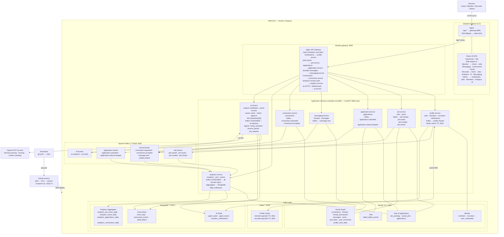

# System Architecture

**LinkedIn Agentic AI Platform**
DATA236 — Distributed Systems Group Project 12
San Jose State University

---

## Table of Contents

1. [Overview](#1-overview)
2. [Technology Stack](#2-technology-stack)
3. [Architecture Diagram](#3-architecture-diagram)
4. [Layer-by-Layer Breakdown](#4-layer-by-layer-breakdown)
   - 4.1 CI/CD Pipeline
   - 4.2 Frontend
   - 4.3 API Gateway
   - 4.4 Microservices
   - 4.5 Message Bus (Kafka)
   - 4.6 Data Layer
   - 4.7 External Services
5. [Data Flow](#5-data-flow)
6. [Database Responsibilities](#6-database-responsibilities)
7. [Kafka Topics](#7-kafka-topics)
8. [AI Workflow](#8-ai-workflow)
9. [Deployment](#9-deployment)
10. [Why Kafka is Behind the API Layer](#10-why-kafka-is-behind-the-api-layer)

---

## 1. Overview

The platform is a LinkedIn-style professional networking and AI-powered recruiting system. It covers the full hiring lifecycle: member profiles, job postings, applications, threaded messaging, social connections, event-driven analytics, and an AI recruiting copilot with a human-in-the-loop approval gate.

The architecture is a **modular monolith deployed as containerised services**. All seven FastAPI services share a single Python codebase, the same SQLAlchemy models, and the same database connections — they are separated at the entry-point and container boundary, not at the codebase or data-store boundary. This is a deliberate practical choice for a course project; true microservices would require separate codebases, separate databases, and service-to-service API contracts.

The entire stack runs on a single AWS EC2 instance orchestrated by Docker Compose. Services communicate internally over Docker's bridge network; only ports `5173` (frontend) and `8000` (API gateway) are exposed publicly.

---

## 2. Technology Stack

| Layer | Technology |
|-------|-----------|
| Frontend | React 19 + TypeScript + Vite |
| Frontend Serving | Nginx (inside Docker) |
| API Framework | FastAPI 0.115 (Python 3.11) — async REST + WebSocket |
| Schema Validation | Pydantic v2 |
| API Gateway | Nginx (reverse proxy) |
| Primary Database | MySQL 8.0 — transactional relational data |
| Document Store | MongoDB 7.0 — event logs, AI state, analytics aggregates |
| Cache | Redis 7.0 — profile/recruiter lookup cache |
| Message Bus | Apache Kafka 3.7 (KRaft mode — no Zookeeper) |
| ORM | SQLAlchemy 2.x + PyMySQL |
| Async Mongo Driver | Motor 3.6 |
| Async Kafka Client | aiokafka 0.11 |
| AI Inference | OpenAI GPT-4o-mini (primary) · Ollama llama3.2 (local fallback) |
| Containerization | Docker + Docker Compose |
| CI/CD | GitHub Actions → SSH → EC2 |

---

## 3. Architecture Diagram

Paste into [https://mermaid.live](https://mermaid.live) to render.



---

## 4. Layer-by-Layer Breakdown

### 4.1 CI/CD Pipeline

```
Developer → git push → main
    └── GitHub Actions (.github/workflows/deploy.yml)
            SSH into EC2
            git pull
            docker-compose up --build -d
```

Every push to `main` triggers an automated deploy. The EC2 rebuilds changed service images and restarts containers with zero manual intervention.

---

### 4.2 Frontend

**Container:** `linkedin-frontend` — port `5173`

The frontend is a React 19 single-page application built with TypeScript and Vite. Nginx serves the built SPA and proxies all `/api/*` requests to the API gateway.

**Role-based tab visibility:**

| Role | Visible Tabs |
|------|-------------|
| Guest | Home · Sign In |
| Member | Home · Jobs · My Network · Messaging · Connections · Career Coach |
| Recruiter | Home · Jobs · Analytics · AI Tools · Messaging |
| Admin | Dashboard · Jobs · Members · Analytics · AI Tools |

**Key frontend components:**

- `App.tsx` — root layout, auth state, routing
- `PerformanceDashboard.tsx` — live MySQL/Kafka/Redis stats
- `JobsTab.tsx` — job search with cursor pagination
- `MessagingTab.tsx` — threaded real-time messaging
- `ConnectionsTab.tsx` — connection graph with mutual counts
- `AIToolsTab.tsx` — recruiter AI workflow with WebSocket progress

---

### 4.3 API Gateway

**Container:** `linkedin-gateway` — port `8000`

Nginx reverse proxy routes requests by URL prefix to the appropriate microservice. All services are on Docker's internal network and not directly reachable from outside.

| URL Prefix | Target Service |
|-----------|---------------|
| `/auth/*` `/members/*` `/recruiters/*` `/notifications/*` | `profile-service:8000` |
| `/jobs/*` `/posts/*` | `job-service:8000` |
| `/applications/*` | `application-service:8000` |
| `/threads/*` `/messages/*` | `messaging-service:8000` |
| `/connections/*` | `connection-service:8000` |
| `/analytics/*` `/events/*` `/perf/*` | `analytics-service:8000` |
| `/ai/*` (HTTP + WebSocket) | `ai-service:8000` |

WebSocket upgrade headers are set on the `/ai/*` block to support `/ai/ws/task/{id}`.

---

### 4.4 Application Services

All services are FastAPI applications running on port `8000` internally, built from a shared `Dockerfile.service` with the entry point configured per service via a build arg. They share a single Python codebase, the same SQLAlchemy models, and the same MySQL/MongoDB/Redis connections — this is a **modular monolith** deployed as separate containers, not true microservices.

#### Profile Service (`main_profile.py`)

Owns identity and profile data.

| Router | Endpoints |
|--------|-----------|
| `/auth` | `POST /login` · `POST /login-form` · `POST /register/member` · `POST /register/recruiter` · `GET /me` |
| `/members` | `POST /get` · `POST /search` · `POST /update` · `POST /delete` · `POST /resume/upload` |
| `/recruiters` | `POST /get` · `POST /search` · `POST /update` · `POST /delete` |
| `/notifications` | `POST /list` |

- JWT authentication (HS256, 24h expiry)
- Passwords hashed with bcrypt stored in `user_credentials`
- Redis cache on `/members/get` and `/recruiters/get` (TTL 300s, write-invalidated)
- Publishes `profile.viewed` to Kafka

#### Job Service (`main_job.py`)

Owns job postings and the posts/social feed.

| Router | Endpoints |
|--------|-----------|
| `/jobs` | `POST /create` · `POST /get` · `POST /update` · `POST /close` · `POST /search` · `POST /save` · `POST /unsave` · `POST /savedByMember` · `POST /byRecruiter` |
| `/posts` | `POST /create` · `POST /feed` · `POST /like` · `POST /delete` · `POST /comments/add` · `POST /comments/list` · `GET /{post_id}/reactions` |

- Job search uses MySQL FULLTEXT index with keyset cursor pagination
- Publishes `job.viewed`, `job.saved`, `job.created`, `job.closed` to Kafka

#### Application Service (`main_application.py`)

Owns the full application lifecycle.

| Endpoints |
|-----------|
| `POST /submit` · `POST /get` · `POST /byJob` · `POST /byMember` · `POST /updateStatus` · `POST /addNote` · `POST /withdraw` |

- Validates job is `open` before accepting submissions
- Duplicate-application guard at application layer + unique DB index
- Kafka publish failures written to `failed_kafka_events` (MySQL) as fallback
- Publishes `application.submitted`, `application.statusChanged`

#### Messaging Service (`main_messaging.py`)

Owns threaded messaging between members and recruiters.

| Endpoints |
|-----------|
| `POST /threads/open` · `POST /threads/get` · `POST /threads/byUser` · `POST /messages/send` · `POST /messages/list` |

- Polymorphic participants: `user_type = member | recruiter`
- Message send uses 3-attempt retry loop with rollback on failure
- Publishes `message.sent` to Kafka

#### Connection Service (`main_connection.py`)

Owns the social connection graph.

| Endpoints |
|-----------|
| `POST /request` · `POST /accept` · `POST /reject` · `POST /remove` · `POST /list` · `POST /pending` · `POST /mutual` |

- Re-request allowed on previously rejected connections (reuses row, updates to `pending`)
- Accept increments `connections_count` on both members in the same transaction
- Publishes `connection.requested`, `connection.accepted` to Kafka

#### Analytics Service (`main_analytics.py`)

Owns all analytics queries and Kafka consumption.

| Router | Endpoints |
|--------|-----------|
| `/analytics` | `POST /jobs/top` · `POST /jobs/top-monthly` · `POST /jobs/least-applied` · `POST /jobs/clicks` · `POST /funnel` · `POST /geo` · `POST /geo/monthly` · `POST /member/dashboard` · `POST /saves/trend` |
| `/events` | `POST /ingest` |
| `/perf` | `GET /mysql-stats` · `GET /kafka-stats` · `GET /cache-stats` · `GET /bench-results` · `GET /event-trend` |

- **Kafka consumer** for all domain topics (`linkedin-backend` consumer group)
- Two-layer idempotency: in-memory set + MongoDB `processed_events` (unique index)
- Dead-letter queue after 3 handler failures
- Pre-aggregated MongoDB daily collections for click/save/application/connection analytics

#### AI Service (`main_ai.py`)

Owns the AI recruiting workflow.

| Endpoints |
|-----------|
| `POST /analyze-candidates` · `GET /task-status/{task_id}` · `POST /approve` · `POST /parse-resume` · `POST /parse-resume-pdf` · `POST /match` · `POST /career-coach` · `POST /career-coach-pdf` · `GET /metrics` · `GET /queue-status` · `POST /tasks/list` |
| `WS /ws/task/{task_id}` |

- Dispatcher enforces `MAX_CONCURRENT_WORKFLOWS = 2` via `asyncio.Queue` + semaphore
- All task state persisted to MongoDB — survives server restarts
- `queued` tasks are re-dispatched on restart; `running` tasks marked `interrupted`
- WebSocket streams real-time step progress to the recruiter UI
- Falls back to regex parsing and template outreach when OpenAI is unavailable

---

### 4.5 Message Bus (Kafka)

**Container:** `linkedin-kafka` — port `9092` (internal) · `9094` (external)

Single-broker Kafka 3.7 running in KRaft mode (no Zookeeper). Auto topic creation enabled.

**Consumer group:** `linkedin-backend` — single consumer instance co-located with the analytics service.

**Delivery guarantee:** At-least-once with manual offset commit. Idempotency layer converts this to effectively-exactly-once execution.

**Commit sequence:**
```
1. Poll message
2. Idempotency check — in-memory set
3. Idempotency check — MongoDB processed_events
4. Execute handler
5. Write idempotency record to MongoDB
6. consumer.commit()
```

---

### 4.6 Data Layer

#### MySQL 8.0 (`:3306`)

Primary transactional store. All relational data with FK constraints.

| Group | Tables |
|-------|--------|
| Identity | `members` · `recruiters` · `user_credentials` |
| Jobs | `job_postings` · `saved_jobs` |
| Applications | `applications` |
| Social Graph | `connections` · `threads` · `thread_participants` · `messages` |
| Content | `posts` · `post_likes` · `post_comments` · `profile_view_daily` |
| Infra | `failed_kafka_events` |

#### MongoDB 7 (`:27017`)

Document store for schema-flexible, write-heavy data.

| Collection Group | Collections |
|-----------------|-------------|
| Event Store | `event_logs` · `processed_events` · `dead_letters` · `processing_attempts` |
| Analytics Aggregates | `analytics_job_clicks_daily` · `analytics_saves_daily` · `analytics_applications_daily` · `analytics_connections_daily` · `job_member_views` |
| AI State | `agent_tasks` · `agent_traces` · `member_notifications` |

#### Redis 7 (`:6379`)

In-memory cache for high-frequency profile lookups.

| Key Pattern | TTL | Evicted By |
|-------------|-----|-----------|
| `members:get:{member_id}` | 300s | `/members/update` · `/members/delete` |
| `recruiters:get:{recruiter_id}` | 300s | `/recruiters/update` · `/recruiters/delete` |

---

### 4.7 External Services

**OpenAI GPT-4o-mini** — called over HTTPS by the AI service for:
- Resume text parsing → structured JSON (name, skills, experience, education)
- Candidate-job fit scoring
- Personalized outreach email generation
- Career coaching responses

**Fallback behavior when OpenAI is unavailable:**

| Skill | Fallback |
|-------|---------|
| Resume Parser | Regex extraction (email, phone, skill keywords) |
| Job Matcher | Pure algorithmic scoring — no LLM needed |
| Outreach Generator | Fill-in template with candidate name and job title |
| Career Coach | Heuristic suggestions based on skill gap analysis |

All AI workflows complete and reach `awaiting_approval` regardless of OpenAI availability.

---

## 5. Data Flow

### Member applies to a job

```
Browser → POST /applications/submit
    → application-service
        → MySQL: INSERT applications
        → MySQL: UPDATE job_postings.applicants_count
        → Kafka: PUBLISH application.submitted
            → analytics-service (consumer)
                → MongoDB: upsert analytics_applications_daily
```

### Recruiter runs AI candidate analysis

```
Browser → POST /ai/analyze-candidates
    → ai-service
        → MongoDB: INSERT agent_tasks {status: queued}
        → HTTP 200: {task_id}
        → Background dispatcher:
            → MySQL: fetch job + top candidates
            → OpenAI: parse each resume
            → Algorithm: score each candidate
            → OpenAI: generate outreach drafts
            → MongoDB: UPDATE agent_tasks {status: awaiting_approval}
            → WebSocket: push progress to browser

Browser → POST /ai/approve {approved: true}
    → MongoDB: UPDATE agent_tasks {status: approved}
```

### Job view triggers analytics

```
Browser → POST /jobs/get
    → job-service
        → Redis: check cache
        → MySQL: read job_postings (on cache miss)
        → Kafka: PUBLISH job.viewed
            → analytics-service (consumer)
                → MySQL: UPDATE job_postings.views_count
                → MongoDB: upsert analytics_job_clicks_daily
```

---

## 6. Database Responsibilities

| Data | MySQL | MongoDB | Redis |
|------|-------|---------|-------|
| Member profiles | ✅ source of truth | | ✅ cache |
| Job postings | ✅ source of truth | | ✅ cache |
| Applications | ✅ source of truth | | |
| Connections | ✅ source of truth | | |
| Messages | ✅ source of truth | | |
| Kafka events | | ✅ event_logs | |
| Kafka idempotency | | ✅ processed_events | |
| Analytics aggregates | | ✅ daily collections | |
| AI task state | | ✅ agent_tasks | |
| AI traces | | ✅ agent_traces | |

---

## 7. Kafka Topics

| Topic | Producer | Consumer | Handler |
|-------|----------|----------|---------|
| `job.created` | job-service | analytics-service | Log to MongoDB |
| `job.viewed` | job-service | analytics-service | Increment `views_count`; upsert `analytics_job_clicks_daily` |
| `job.saved` | job-service | analytics-service | Log to MongoDB; upsert `analytics_saves_daily` |
| `job.closed` | job-service | analytics-service | Log to MongoDB |
| `application.submitted` | application-service | analytics-service | Upsert `analytics_applications_daily` (applicants_count is incremented by the HTTP handler, not the consumer) |
| `application.statusChanged` | application-service | analytics-service | Log to MongoDB |
| `message.sent` | messaging-service | analytics-service | Log to MongoDB |
| `connection.requested` | connection-service | analytics-service | Log to MongoDB; upsert `analytics_connections_daily` |
| `connection.accepted` | connection-service | analytics-service | Log to MongoDB |
| `profile.viewed` | profile-service | analytics-service | Log to MongoDB |
| `ai.requests` | ai-service | ai-service | Trigger workflow |
| `ai.results` | ai-service | ai-service | Log step results to MongoDB |

All messages follow a standard envelope:
```json
{
  "event_type": "job.viewed",
  "trace_id": "uuid",
  "timestamp": "2026-05-01T10:00:00Z",
  "actor_id": "42",
  "entity": { "entity_type": "job", "entity_id": "7" },
  "payload": {},
  "idempotency_key": "uuid"
}
```

---

## 8. AI Workflow

### Supervisor Agent Pattern

```
POST /ai/analyze-candidates { job_id, top_n }
    │
    │ Returns immediately: { task_id }
    │
    └── Background: run_hiring_workflow(task_id, job_id, top_n)
            │
            ├── Step 1: fetch_data
            │       MySQL: fetch job details + top N applicants
            │
            ├── Step 2: resume_parser (per candidate)
            │       OpenAI → structured JSON
            │       Fallback: regex extraction
            │       MongoDB: agent_traces
            │
            ├── Step 3: job_matcher (per candidate)
            │       Skills (50%) + Location (20%) + Seniority (30%)
            │       MongoDB: agent_traces
            │
            ├── Step 4: outreach_generator (top N only)
            │       OpenAI → personalized email draft
            │       Fallback: fill-in template
            │       MongoDB: agent_traces
            │       Kafka: ai.results
            │
            └── Step 5: persist_result
                    MongoDB: agent_tasks.status = "awaiting_approval"
                    WebSocket: push to connected clients
```

### Task Lifecycle

```
queued → running → awaiting_approval → approved
                                     → rejected
              └── failed
              └── interrupted  (server restart mid-flight)
```

### Human-in-the-Loop Gate

```
POST /ai/approve { task_id, approved: true|false, feedback: "..." }
    → MongoDB: UPDATE agent_tasks.status = approved | rejected
```

---

## 9. Deployment

### Docker Compose Services

| Container | Image | Port |
|-----------|-------|------|
| `linkedin-frontend` | Custom (Vite + Nginx) | 5173 |
| `linkedin-gateway` | `nginx:alpine` | 8000 |
| `linkedin-profile-service` | Custom FastAPI | — |
| `linkedin-job-service` | Custom FastAPI | — |
| `linkedin-application-service` | Custom FastAPI | — |
| `linkedin-messaging-service` | Custom FastAPI | — |
| `linkedin-connection-service` | Custom FastAPI | — |
| `linkedin-analytics-service` | Custom FastAPI | — |
| `linkedin-ai-service` | Custom FastAPI | — |
| `linkedin-mysql` | `mysql:8.0` | 3306 |
| `linkedin-mongodb` | `mongo:7` | 27017 |
| `linkedin-redis` | `redis:7-alpine` | 6379 |
| `linkedin-kafka` | `apache/kafka:3.7.0` | 9092 · 9094 |

**Total: 13 containers** on a single EC2 instance.

### Health Checks

All data layer containers have Docker health checks. Backend microservices declare `depends_on` with `condition: service_healthy` for MySQL, MongoDB, Redis, and Kafka before starting.

### Environment Configuration

All backend services share environment variables via the `x-backend-common` YAML anchor in `docker-compose.yml`. Database credentials, Kafka bootstrap servers, and Redis host are injected at container start — no credentials in the image.

---

## 10. Why Kafka is Behind the API Layer

Kafka is used strictly as an **asynchronous side-effect bus**, not as the primary communication channel. The ordering is always:

```
Browser → HTTP → FastAPI handler → (synchronous) MySQL/Redis
                                  → (fire-and-forget) Kafka publish
                                              ↓
                                     Kafka consumer
                                     (analytics / AI side effects)
```

**What must never happen:**
- The browser publishing directly to Kafka
- Kafka replacing the HTTP request/response path
- The frontend being aware Kafka exists

**Why this boundary exists:**

| Concern | Explanation |
|---------|-------------|
| HTTP gives the browser a synchronous result | The member gets an immediate success/failure response, not an eventual one |
| Kafka is fire-and-forget | A Kafka publish failure does not roll back the database transaction |
| Consumers are not the source of truth | MySQL is authoritative; Kafka drives analytics and AI side effects only |
| Double-counting protection | `applicants_count` is incremented atomically in the HTTP handler; the `application.submitted` consumer explicitly skips it to prevent double-counting |

**Kafka dual-write fallback:** If a Kafka publish fails (broker temporarily unavailable), all five routers that publish events write the failed event to `failed_kafka_events` in MySQL so no event is silently lost.
